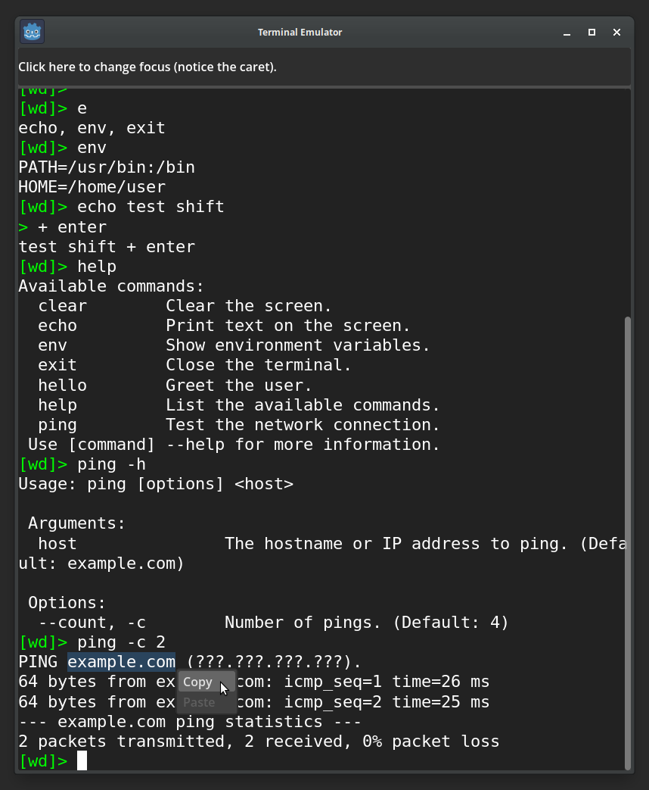

# Terminal Emulator for Godot

This is a starting point to create your own terminal emulator in a Godot game, for example, to implement hacking-style gameplay.

Creating a terminal emulator is a complex task. You cannot simply use a *RichTextLabel*, as it comes with numerous limitations. The proper approach is to draw each character manually.

The code runs efficiently, but if desired, you can convert it to *C#* for maximum performance.

## Features

* Editable prompt, colors, monospaced font, and fully functional caret.
* Internal environment variables.
* Command history.
* Autocompletion with `Tab`.
* Command argument parsing: typed options (value, integer, flag), short and long names, positional arguments (required or optional with defaults), bundled short flags, and error reporting.
* Auto-generated help: running any command with `--help` or `-h` prints usage, arguments, and options derived from its schema.
* Wrapped lines that adjust automatically when the window is resized.
* Text selection with the mouse, with copy and paste support (both via shortcuts and the popup menu).
* Commands can run for extended periods (e.g. simulating `ping`) without freezing the UI.
* Multi-line paste executes commands sequentially without freezing the UI.
* Automatic and manual scrolling.
* Popup menu for copy, paste, and potential future features.
* Multi-line command input using `Shift + Enter`.
* Word-based cursor navigation using `Ctrl + arrows` or `Alt + arrows`.
* Can gain and lose focus, allowing integration with other windows or panels.

## Supported Shortcuts

* `Ctrl + Shift + C` or `Shift + Insert` → Copy selection to clipboard.
* `Ctrl + Shift + V` → Paste from clipboard.

### Optional behaviors you may want to add

Depending on how realistic or feature-complete you want the terminal to be, and the purpose it serves in your game, you may choose to implement the following behaviors too:

* Middle mouse button: paste from the primary selection (the currently selected text in the OS); mainly useful for hacking-style gameplay.
* `Ctrl + C` → SIGINT.
* `Ctrl + Z` → SIGTSTP: suspend the process and move it to the background.
* `Ctrl + K` → Kill to End: delete from the cursor to the end of the line.
